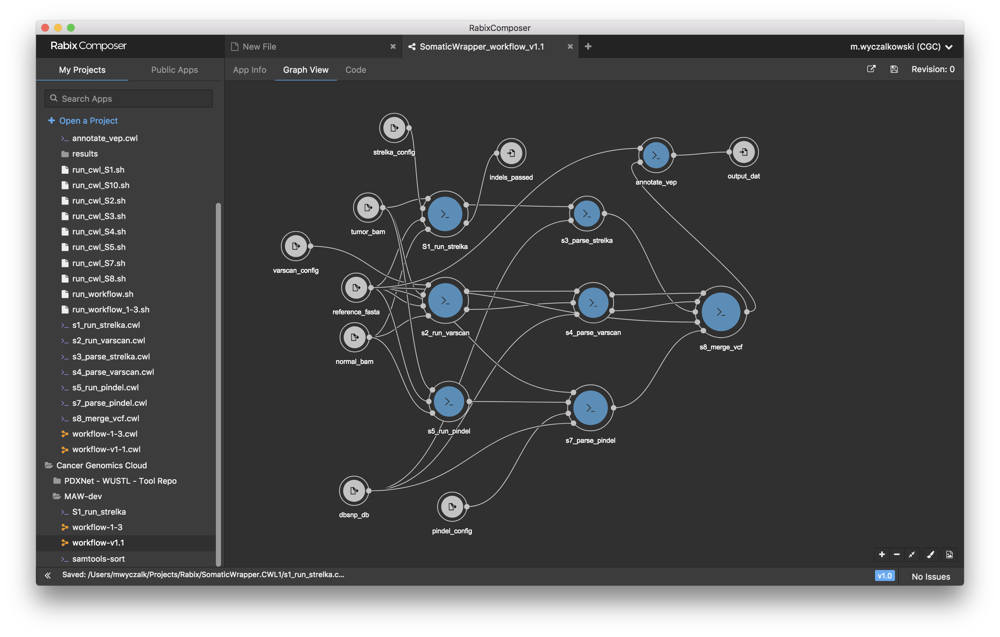

#  TinDaisy

TinDaisy is CWL wrapper around the [SomaticWrapper](https://github.com/ding-lab/somaticwrapper/tree/cwl) variant caller, and includes
test data to demonstrate execution via Rabix Executor.

GitHub: https://github.com/ding-lab/tin-daisy

## Overview

The goal of TinDaisy is to

* Serve as a quick start guide and reference implementation for SomaticWrapper usage and CWL development
* Provide StrelkaDemo dataset for testing
* Serve as reference project for `cwl` branch of somaticwrapper.

# Getting Started

## Installation
TinDaisy requires several packages to run.

**[Install Docker](https://www.docker.com/community-edition)**
Be sure it is running before running `rabix`.

**Install [TinDaisy](https://github.com/ding-lab/tin-daisy)**
```
git clone https://github.com/ding-lab/tin-daisy
cd tin-daisy
```

**[Install Rabix Executor](https://github.com/rabix/bunny)**
```
wget https://github.com/rabix/bunny/releases/download/v1.0.5-1/rabix-1.0.5.tar.gz -O rabix-1.0.5.tar.gz && tar -xvf rabix-1.0.5.tar.gz
```

Test Rabix Executor with,
```
cd rabix-cli-1.0.5
./rabix examples/dna2protein/dna2protein.cwl.json examples/dna2protein/inputs.json
```
This should run for a few seconds and then produce output like,
```
[2018-04-20 14:38:24.655] [INFO] Job root.Translate has completed
{
  "output_protein" : {
    "basename" : "protein.txt",
    "checksum" : "sha1$55adf0ec2ecc6aee57a774d48216ac5a97d6e5ba",
    "class" : "File",
    "contents" : null,
    "dirname" : "/Users/mwyczalk/tmp/tin-daisy/rabix-cli-1.0.5/examples/dna2protein/dna2protein.cwl-2018-04-20-143817.231/root/Translate",
    "format" : null,
    "location" : "file:///Users/mwyczalk/tmp/tin-daisy/rabix-cli-1.0.5/examples/dna2protein/dna2protein.cwl-2018-04-20-143817.231/root/Translate/protein.txt",
    "metadata" : null,
    "nameext" : ".txt",
    "nameroot" : "protein",
    "path" : "/Users/mwyczalk/tmp/tin-daisy/rabix-cli-1.0.5/examples/dna2protein/dna2protein.cwl-2018-04-20-143817.231/root/Translate/protein.txt",
    "secondaryFiles" : [ ],
    "size" : 9
  }
}
```

Optionally install [SomaticWrapper (CWL branch)](https://github.com/ding-lab/somaticwrapper/tree/cwl). Note
  SomaticWrapper is distributed within the Docker image `cgc-images.sbgenomics.com/m_wyczalkowski/somatic-wrapper:cwl`
``` 
git clone -b cwl https://github.com/ding-lab/somaticwrapper 
```

## Log into CGC

In some cases (all?) it is necessary to log into CGC to pull latest somatic-wrapper image.  To do this,
`docker login cgc-images.sbgenomics.com`
Username is normal, password is token string obtained from CGC: https://cgc.sbgenomics.com

## Running TinDaisy

To run the entire TinDaisy workflow on a test dataset (named "StrelkaDemo"),
```
bash run_workflow.sh
```
This should run for a minute or so and produce a lot of output ending in something like,
```
[2018-04-20 14:45:21.787] [INFO] Job root.annotate_vep has completed
{
  "output_dat" : [ {
    "basename" : "output.vcf.vep",
    ...
    "size" : 2769
  }, {
    "basename" : "output.vcf.vep_summary.html",
    ...
    "size" : 11178
  } ]
}
```

You will be able to find output for each of the steps of the TinDaisy workflow in the `./results` directory.

Details of the StrelkaDemo dataset are found below.


# Development and testing

There are four levels of code development.

1. Direct command line invocation of SomaticWrapper
2. Executing SomaticWrapper from within a docker container
3. Executing CWL-wrapped SomaticWrapper tool using Rabix Executor
4. Executing a CWL workflow containing 1 or more SomaticWrapper tools

For development and debugging, make sure all prior steps work.  Note that can also run workflows
directly from Rabix Composer.

## Running SomaticWrapper directly

For development and testing, the StrelkaDemo.docker.testing directory has scripts
which will run individual steps of SomaticWrapper directly (i.e., `perl SomaticWrapper.pl ...`)
from within docker container.  See [documentation](StrelkaDemo.docker.testing/README.md) for details.


## Rabix Executor invocation

Individual steps of the SomaticWrapper workflow are defined as CWL tools in the `./cwl` directory and can
be viewed and modified with [Rabix Composer](https://github.com/rabix/composer).

Individual tools can be executed either from within Composer, or as individual shell scripts in `./StrelkaDemo.CWL.testing`. For instance,
```
bash run_cwl_S1.sh
```
will run the `run_strelka` (step 1) of the Somatic Wrapper workflow.

The CWL workflow consists of 8 such tools, seen below in a Rabix Composer view
 

The entire pipeline can be executed using the StrelkaDemo test dataset with,
```
bash run_workflow.sh
```

## Beyond StrelkaDemo

Edit `project_config.sh` appropriately.  Run `bash run_workflow.sh`.

The file `run_workflow.C3N-01649.sh` provides an example using real data

# Development details

## Configuration files

`project_config.sh` has various path definitions.

**TODO** Look at and describe `VEP_CACHE_DIR` - it has an absolute file path here

* currently, `--vep_cache_dir` is not supported as a way to share VEP cache with `vep_annotation` and `vcf_2_maf` steps
because Rabix does not stage directories.  VEP cache must be passed as a `.tar.gz` file.  This may change in the future.


## StrelkaDemo details

`StrelkaDemo` data consists of two small (50Kb) tumor and normal BAM files.  These are [distributed with
Strelka](https://github.com/Illumina/strelka/tree/master/src/demo/data) (hence the name), as well as
in the `./StrelkaDemo.dat` directory.


### Details about centromere BED files distributed in StrelkaDemo.dat

*Create BED files defining centromeres and other featues*

A centromere BED file is used for Pindel to define regions to be excluded
from analysis.  While optional, it is used for performance purposes.

Three such files are distributed:
* pindel-centromere-exclude.bed  -  this file is for GRCh37, and was used for internal development purposes.  It has an unknown provenance.
* ucsc-centromere.GRCh37.bed - Data generated from UCSC Table Browser for GRCh37 assembly as described below
* ucsc-centromere.GRCh38.bed - Data generated from UCSC Table Browser for GRCh38 assembly as described below

There is no reason in most cases to do anything in this directory, but instructions of how to manually obtain UCSC data are below.

#### ucsc-centromere.GRCh37.bed

Table is obtained manually from [UCSC Table Browser](http://genome.ucsc.edu/cgi-bin/hgTables)
* *Assembly:* GRCh37
* *Group:* All Tables
* *Table:* Gap
* *Filter:* Type matches "centromere"
* *Output format:* BED
* *Output File:* ucsc-centromere.GRCh37.bed
* Defaults for *Output gap as BED*


#### ucsc-centromere.GRCh38.bed

Table is obtained manually from [UCSC Table Browser](http://genome.ucsc.edu/cgi-bin/hgTables).  Note that GRCh38 treats centromeres differently than GRCh37, as described [here](https://groups.google.com/a/soe.ucsc.edu/forum/#!topic/genome/SaR2y4UNrWg).
* *Assembly:* GRCh38
* *Group:* All Tables
* *Table:* Centromeres
* *Output format:* BED
* *Output File:* ucsc-centromere.GRCh38.bed
* Defaults for *Output gap as BED*
