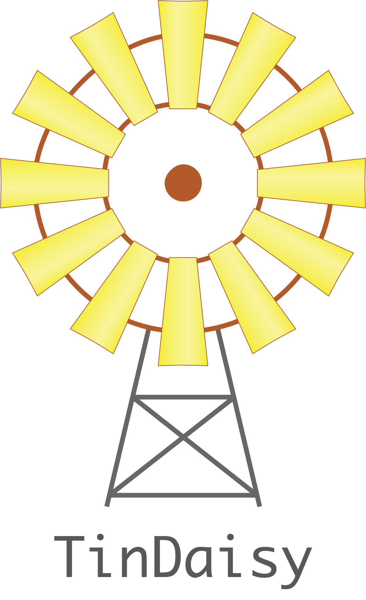
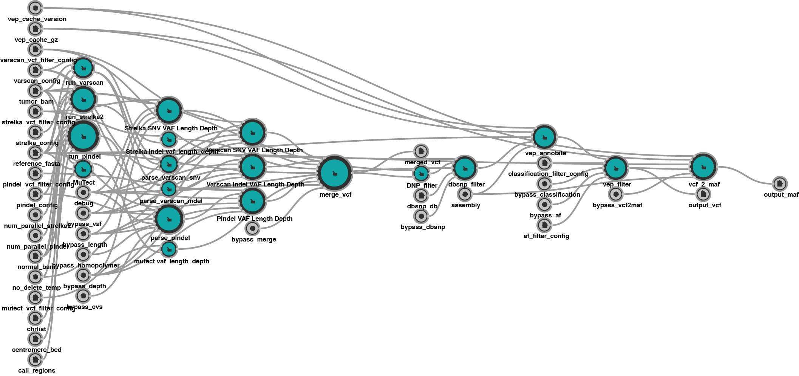

#  TinDaisy

# TODO

* Describe versioning
* Discuss CWL and CQ code

[TinDaisy](https://github.com/ding-lab/tin-daisy) is a CWL pipeline for calling
somatic variants fronm tumor and normal exome data.  TinDaisy implements
functionality from [TinDaisy-Core](https://github.com/ding-lab/TinDaisy-Core)
to obtain variant calls, merge and filter them; other CWL tools outside of
TinDaisy-Core are also integrated into the TinDaisy pipeline.  TinDaisy also
includes a simple workflow manager to allow for command-line driven management
of jobs in a Cromwell workflow engine environment.

# Overview

Callers used:

* [Strelka2](https://github.com/Illumina/strelka.git)
* [VarScan.v2.3.8](http://varscan.sourceforge.net/)
* [Pindel](https://github.com/ding-lab/pindel.git)
* [mutect-1.1.7](https://github.com/broadinstitute/mutect)

SNV calls from Strelka2, Varscan, Mutect. Indel calls from Stralka2, Varscan, and Pindel.
[CWL Mutect Tool](https://github.com/mwyczalkowski/mutect-tool) is used for CWL Mutect calls

Filters applied (details in VCF output)
* For indels, require length < 100
* Require normal VAF <= 0.020000, tumor VAF >= 0.050000 for all variants
* Require read depth in tumor > 14 and normal > 8 for all variants 
* All variants must be called by 2 or more callers
* Require Allele Frequency < 0.005000 (as determined by vep)
* Retain exonic calls
* Exclude calls which are in dbSnP but not in COSMIC
* Two or more SNPs adjacent on same haplotype merged into MNPs using [DNP_Filter](TODO)

Majority of above processing is implemented in
[TinDaisy-Core](https://github.com/ding-lab/TinDaisy-Core), which was developed
from [SomaticWrapper](https://github.com/ding-lab/somaticwrapper) and
[GenomeVIP](https://genomevip.readthedocs.io/) projects.  [DNP_Filter](TODO) is
implemented as a separate project and CWL tool.


**TODO** confirm image below displays correctly.



*caption* overview of TinDaisy CWL as visualized with [Rabix Composer](http://docs.rabix.io/rabix-composer-home)


## Changelog

*TODO* complete this

Note there are two readers of Changelog: users and scientists.  For the latter be clear about
algorithms used and any changes to data formats or results.  Former will be interested
in workflow management

* List TinDaisy commits or tags which are associated with a data release
    *  Indicate any differences which may result in changes to processed data

* 


# Getting Started

## Simple example

TODO: show example of running java cromwell directly

## CromwellRunner workflow manager

CromwellRunner is a workflow manager for TinDaisy runs.  It consists of the following utilities:
* cq - query cromwell server
* datatidy - manage TinDaisy run results 
* rungo - launch TinDaisy jobs 
* runplan - initialize TinDaisy jobs
* runtidy - Organize TinDaisy job logs

Goal of CromwellRunner is to initialize, launch, inspect, clean up, restart,
and log TinDaisy runs, particularly for batches of tens and hundreds of runs.
See [CromwellRunner](TODO) documentation for additional details and examples


# Installation
TinDaisy can be obtained from GitHub with,
```
git clone https://github.com/ding-lab/tin-daisy
```

[TinDaisy-Core](https://github.com/ding-lab/TinDaisy-Core) code, which performs
the bulk of processing, can be obtained for inspection with,
``` 
git clone https://github.com/ding-lab/TinDaisy-Core
```
and (DNP_Filter)[TODO] can be obtained similarly.  Note that for CWL runs the
TinDaisy-Core code is distributed in a docker image such as `mwyczalkowski/tindaisy-core:20191108`.
See development notes below for details about modifying such code.

[Cromwell]() server needs to be available.  Currently, this has been developed exclusively on MGI
Cromwell implementation.


## CromwellRunner dependencies

The following packages are required for CromwellRunner:
* [`jq`](https://stedolan.github.io/jq/download/)
* [`GNU Parallel`](https://www.gnu.org/software/parallel/)

# Development notes

This needs to be updated.  Demo directory layout and logic are based on [SomaticSV](https://github.com/mwyczalkowski/somatic_sv_workflow)
and [BICSEQ2](https://github.com/mwyczalkowski/BICSEQ2)

TinDaisy has been tested with `cwltool`, `rabix composer`, and `cromwell` CWL engines.

Explain how to incorporate code into TinDaisy-Core, as well as TinDaisy

# Development details

## Configuration files

YAML files supercede `project_config.sh` files to define variables for runs, since YAML can be used for both
Cromwell and Rabix executions.

Currently, `--vep_cache_dir` is not supported as a way to share VEP cache with `vep_annotation` and `vcf_2_maf` steps
because Rabix does not stage directories.  VEP cache must be passed as a `.tar.gz` file and defined with `vep_cache_gz`


## StrelkaDemo details

`StrelkaDemo` data consists of two small (50Kb) tumor and normal BAM files.  These are [distributed with
Strelka](https://github.com/Illumina/strelka/tree/master/src/demo/data) (hence the name), as well as
in the `./StrelkaDemo.dat` directory.  These are used for quickly testing workflow steps, and are described
in more detail in [docs/README.strelka_demo.md](docs/README.strelka_demo.md)


