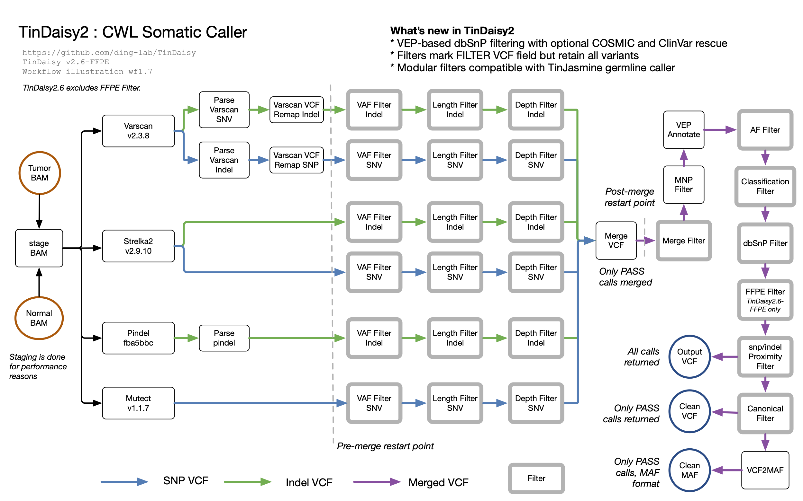
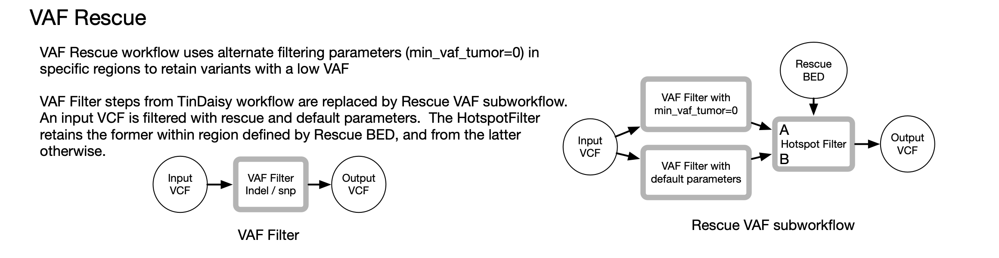

#  TinDaisy2

[TinDaisy2](https://github.com/ding-lab/TinDaisy) is a CWL pipeline for calling
somatic variants from tumor and normal exome data.  It is illustrated below


TODO: Update with FFPE filter, illustrate staging of tumor and normal BAMs

## Overview

The following variant callers are the basis of TinDaisy2 variant calls:
* [VarScan.v2.3.8](http://varscan.sourceforge.net/): SNP and indel calls
* [Strelka2 v2.9.10](https://github.com/Illumina/strelka.git): SNP and indel calls
* [Pindel (Sept 2018)](https://github.com/ding-lab/pindel.git): indel calls only
* [mutect-1.1.7](https://github.com/broadinstitute/mutect): SNP calls only

The following filters are then applied:
* Normal and tumor VAF
* Indel length
* Normal and tumor read depth

Variant calls from all callers are then merged into one VCF file.  Variants called by
two or more callers are retained.  Following merging, the following processing steps
are applied
* Sequential SNPs on same haplotype merged into DNP, TNP, and QNP 
* Annotation with VEP.  Based on annotation, the following filters are applied
    * Population allele frequency 
    * Variant classification (e.g., retain exon only)
    * Presence in dbSnP database of common variants. Those in COSMIC and ClinVar
      databases optionally retained
* SNP variants in proximity to indels are excluded

Variants which fail a filter are retained in the VCF file but are flagged as having
failed that filter.

Three output files are generated:
* Output VCF - contains all variants which were called by 2 or 3 callers.
* Clean VCF - contains only variants which passed all filters
* Clean MAF - MAF file corresponding to Clean VCF

## Workflow versions

The specific paramater values and database versions used are defined in processing
description files with a specific pipeline version.
* [Processing description v2.6](docs/processing_description.v2.6.md)

* Version 2.6.1 - Adds `bypass_classification` parameter.  Also introducing `-ffpe` variant


## VAF Rescue

VAF Rescue is an optional variant of the TinDaisy2 workflow which implements a position-aware VAF filter which applies different
parameters (`min_vaf_tumor=0`) based on location as defined in a
BED file.  Variants with tumor VAF > 0 are retained in regions
given by a Rescue BED file.  This file may be specific to cancer types.



# Running TinDaisy

TinDaisy defines a CWL workflow and algorithms associated with it.  Running it
requires a CWL workflow engine such as [`cwltool`](https://github.com/common-workflow-language/cwltool), 
[`Rabix Executor`](http://docs.rabix.io/rabix-executor-home), or [`Cromwell`](https://cromwell.readthedocs.io/en/stable/).

## Installation

Install TinDaisy with,
```
git clone --recurse-submodules https://github.com/ding-lab/TinDaisy.git
```

Examples of how to run workflows using Cromwell are provided in the
`./testing` diretory.  Production runs are performed using 
[CromwellRunner](https://github.com/ding-lab/CromwellRunner.git),
a simple workflow manager which allows for command-line driven management of jobs in
a Cromwell workflow engine environment, developed primarily for the Wash U RIS and MGI systems.

## Configuration

Configuration of TinDaisy2 is through a YAML configuration file.  A template of such
a file is in `cwl/workflows/tindaisy2.template.yaml`, and example configuration
files for the MGI and compute1 systems can be found in `testing/cromwell-simple/yaml`.

**TODO** provide additional details about all configuration parameters.  These can also be obtained
from the submodules described below.

## Example workflows

Examples for running TinDaisy2 in the Wash U MGI and compute1 environments can be found in
the `testing/cromwell-simple` directory.

## Implementation

TinDaisy relies on a number of modules to implement the various filtering and
processing steps.  In most cases, each module provides the underlying
algorithms, tools to generate the docker image, and CWL definitions needed to
implement it.  The [TinDaisy](/Users/mwyczalk/Projects/TinDaisy/TinDaisy)
module also defines CWL tools whose algorithms are implemented in the
[TinDaisy-Core](https://github.com/ding-lab/TinDaisy-Core) project.

Modules used by TinDaisy2 are,
* [HotspotFilter](https://github.com/ding-lab/HotspotFilter.git)
* [MergeFilterVCF](https://github.com/ding-lab/MergeFilterVCF.git)
* [mnp_filter](https://github.com/ding-lab/mnp_filter)
* [mutect-tool](https://github.com/mwyczalkowski/mutect-tool)
* [SnpIndelProximityFilter](https://github.com/ding-lab/SnpIndelProximityFilter)
* [varscan_vcf_remap](https://github.com/ding-lab/varscan_vcf_remap)
* [vcf2maf-CWL](https://github.com/ding-lab/vcf2maf-CWL.git)
* [VEP_annotate](https://github.com/ding-lab/VEP_annotate.git)
* [VEP_Filter](https://github.com/ding-lab/VEP_Filter.git)
* [VLD_FilterVCF](https://github.com/ding-lab/VLD_FilterVCF.git)

